# 系统序列图(SSD)— FSB 门净宽检查 MVP

> 本文用 Mermaid 序列图描述前后端核心交互。所有关联通过 **IFC GlobalId**(`global_id`)。
> 配套:`PLAN.md`(架构与统一 ID 规范)、`EXPORT_DESIGN.md`(导出流程)。

---

## 0. 角色与术语

| 角色 | 实现 | 职责 |
|---|---|---|
| 用户(U) | 浏览器 | 点选、编辑、标记 |
| 前端(FE) | Vue 3 + xeokit | 3D 渲染、基础信息获取、本地状态、用户输入采集 |
| 后端(BE) | FastAPI + ifcopenshell | IFC 深度解析、规则计算、会话态 |
| ID | IFC GlobalId | 前后端关联纽带 |

---

## 1. 主流程:上传 IFC 并初始化

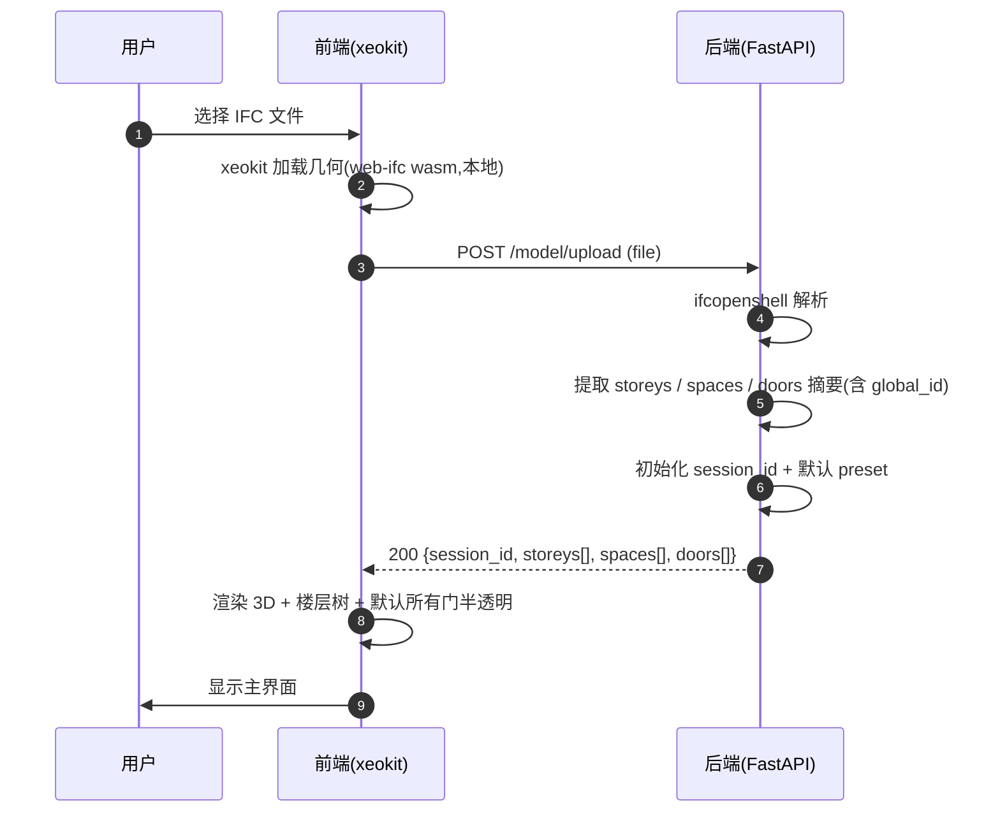

**关键点**
- 前端用 xeokit 自带 web-ifc 解析几何,**不依赖后端**,加载即可点选
- 后端返回的 `doors[]` 每条带 `global_id`,前端以此建立 global_id → xeokit object 句柄映射
- 默认所有门半透明,等待"标记防火门"或"运行检查"后着色

---

## 2. 点选门 → 查看基础信息

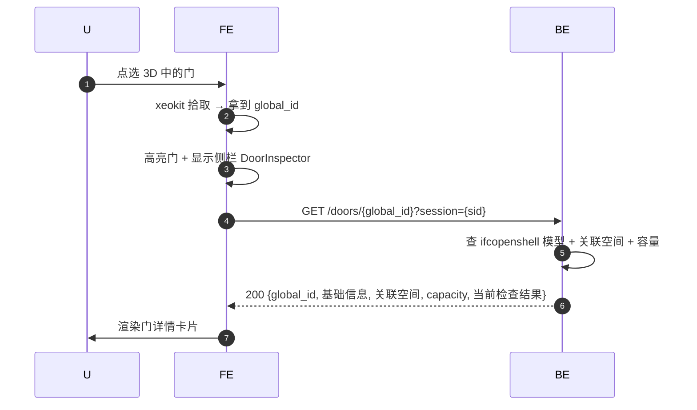

**关键点**
- 前端拾取后**立即**用本地缓存的基础信息(OverallWidth、Name)渲染,后端详情异步补全
- 所有调用都以 `global_id` 为主键,前端永不传数组下标

---

## 3. 触发全局检查

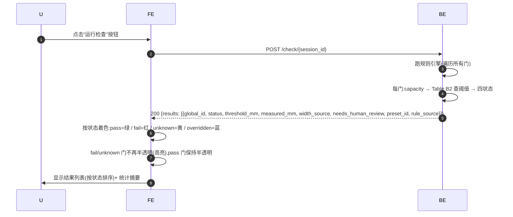

**关键点**
- 检查在后端跑,前端只渲染
- 结果列表的每条记录以 `global_id` 关联 3D 场景中的门

---

## 4. 用户覆盖阈值

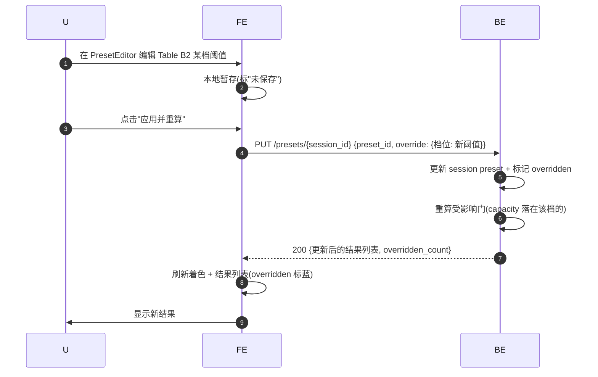

**关键点**
- 阈值覆盖只重算落在该档位的门,不全量重算(性能)
- overridden 状态独立于 pass/fail,UI 用蓝色区分"用户改过阈值后的结果"

---

## 5. 手动标记/取消防火门

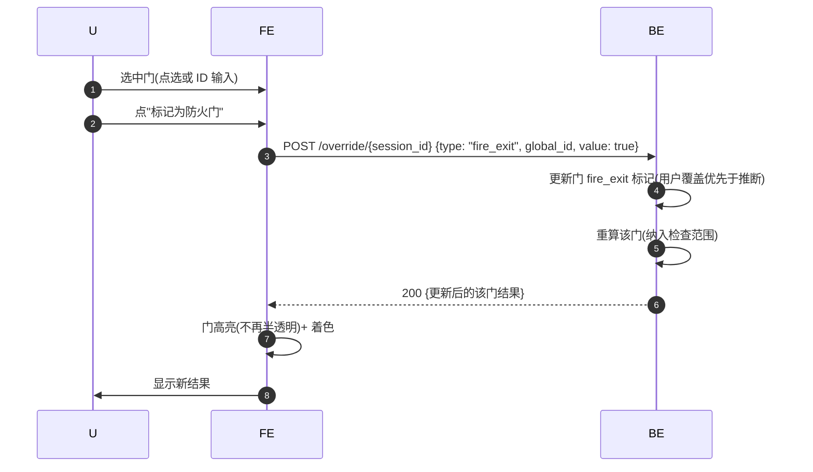

**关键点**
- 因 `Pset_DoorCommon.FireExit` 实测 0%,**所有门默认可选取**,用户手动标记哪些是防火门
- 用户标记优先级 > 后端推断(`inferred_fire_exit`)
- 取消标记走同样端点,value=false

---

## 6. 用户覆盖房间用途 / 人数

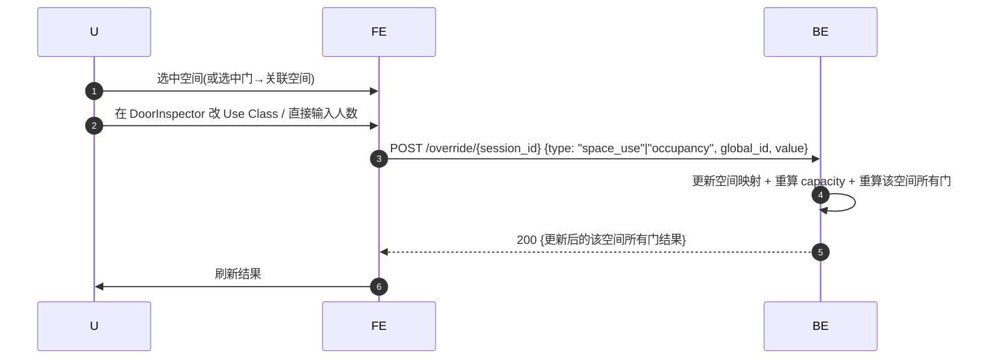

**关键点**
- 房间用途覆盖影响 capacity → 影响档位 → 影响阈值 → 影响结果,链式重算
- 直接输入人数跳过 factor 计算,标 `capacity_source="user_input"`

---

## 7. 快速定位

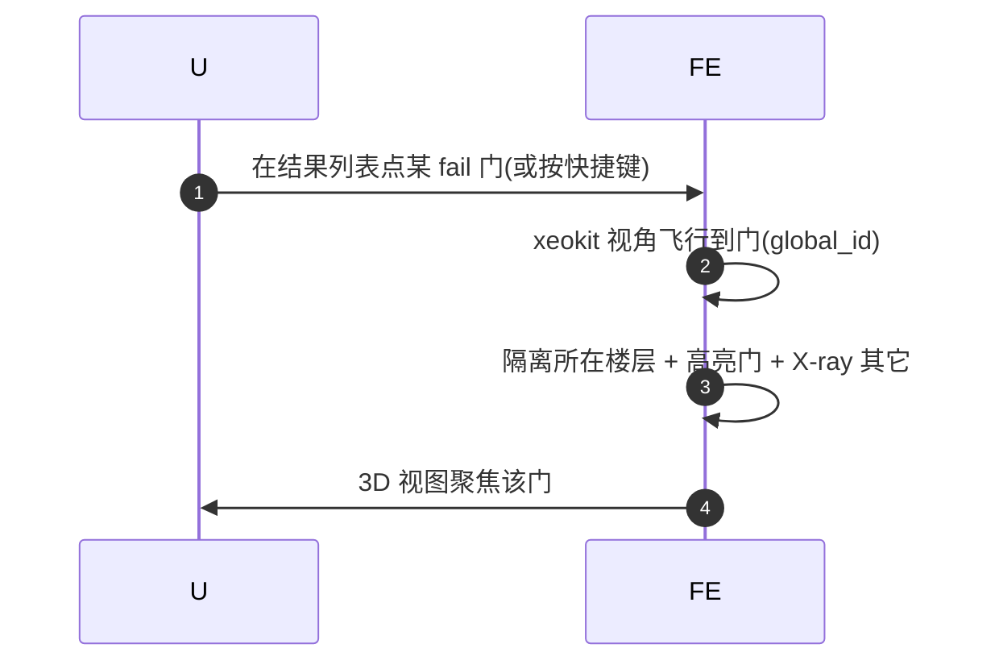

**关键点**
- 纯前端操作,无需后端往返
- 快捷键(如 `F` 跳到下一个 fail)在 CheckResultList 组件内绑定

---

## 8. 导出(暂不实现)

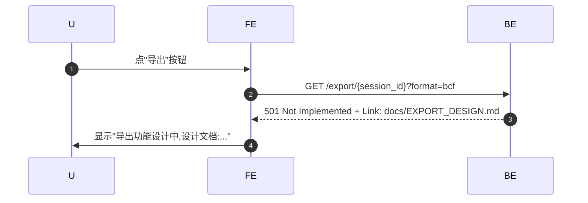

**MVP 阶段**:端点返回 501 + 文档链接,演示视频口述设计思路。

---

## 9. 统一 ID 流转图

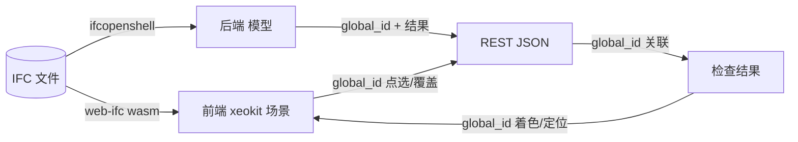

**核心**:IFC 文件被两端各自解析一次,但通过 global_id 始终指向同一实体。前端不持有"后端模型副本",只持有 global_id → 视觉句柄的映射。

---

## 10. 错误与降级流程

### 10.1 后端解析失败
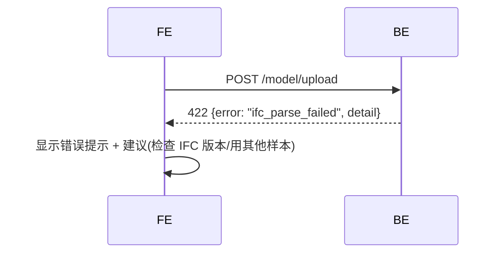

### 10.2 前端拾取的门后端找不到(罕见,IFC4 几何兜底场景)
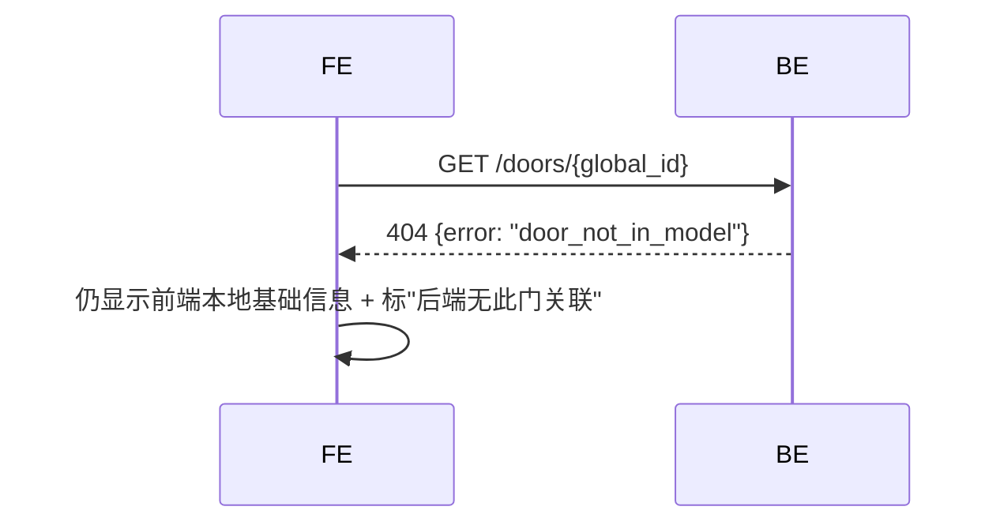

### 10.3 capacity 无法推算
后端返回 `status: "unknown"`, `reason: "cannot_derive_occupant_capacity"`,前端用黄色着色 + 提示用户手工输入人数。

---

## 11. 端点清单(对应 SSD)

| 方法 | 路径 | 用途 | 对应序列图 |
|---|---|---|---|
| POST | `/model/upload` | 上传 IFC,初始化 session | §1 |
| GET | `/model/{sid}/summary` | 楼层/空间/门摘要 | §1 |
| GET | `/doors/{gid}` | 单门详情 | §2 |
| POST | `/check/{sid}` | 跑全量检查 | §3 |
| PUT | `/presets/{sid}` | 覆盖阈值 | §4 |
| POST | `/override/{sid}` | 标记防火门 / 改用途 / 改人数 | §5 §6 |
| GET | `/export/{sid}` | 导出(暂 501) | §8 |
| GET | `/presets` | 默认预设(前端首屏展示) | §1 |
